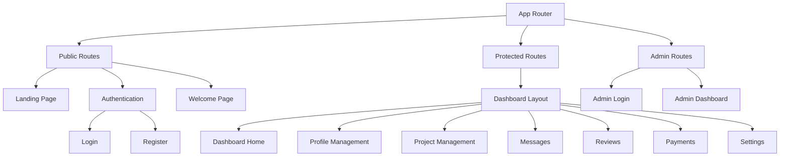
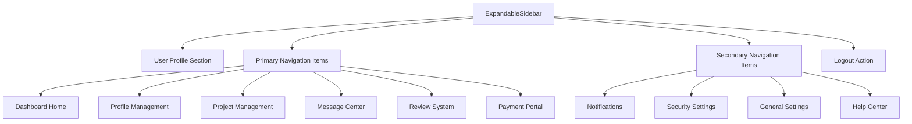
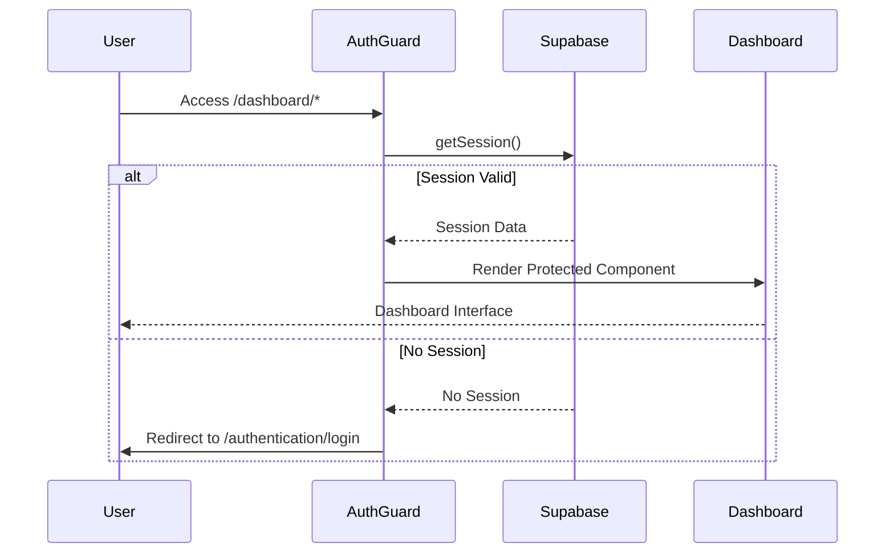
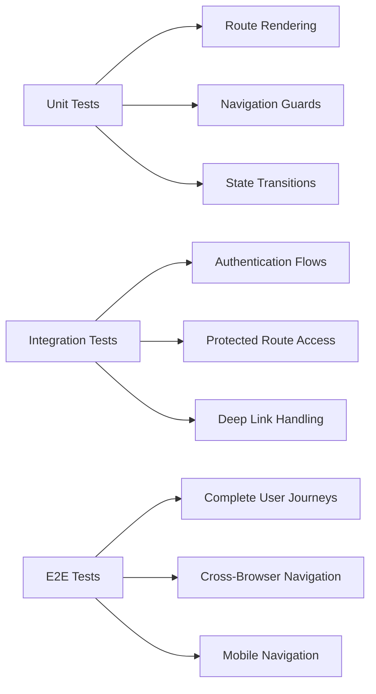

# Steering System Design

## Overview

The Steering System serves as the central navigation architecture for the khadum platform, providing intuitive user navigation across different application layers. This system orchestrates user journeys through authentication flows, dashboard experiences, and administrative interfaces while maintaining consistent UX patterns and accessibility standards.

## Technology Stack & Dependencies

### Core Navigation Framework
- **React Router v6** - Client-side routing with future flags enabled
- **React 18** - Component-based UI framework
- **TypeScript 5.8** - Type-safe navigation interfaces
- **Lucide React** - Consistent iconography across navigation elements

### UI Component Infrastructure
- **ShadCN UI (Radix UI)** - Accessible navigation primitives
- **Tailwind CSS 3.4** - Responsive navigation styling
- **Class Variance Authority** - Dynamic navigation states

## Architecture

### Navigation Hierarchy



### Route Structure

| Route Pattern | Component | Access Level | Purpose |
|--------------|-----------|--------------|---------|
| `/` | Index | Public | Landing page with marketing content |
| `/authentication/login` | Login | Public | User authentication entry |
| `/authentication/register` | Register | Public | Freelancer registration flow |
| `/welcome` | Welcome | Public | Post-registration confirmation |
| `/dashboard/*` | DashboardLayout | Protected | Main user workspace |
| `/admin-login` | AdminLogin | Public | Administrative access |
| `/administrator` | AdminDashboard | Admin | System administration |
| `*` | NotFound | Fallback | Error handling |

## Component Architecture

### Primary Navigation Components

#### App Router (`App.tsx`)
Central routing orchestrator implementing React Router v6 with future compatibility flags.

**Responsibilities:**
- Route definition and matching
- Authentication guard integration
- Error boundary routing
- Query client provider wrapping

**Key Features:**
```typescript
BrowserRouter({
  future: {
    v7_startTransition: true,
    v7_relativeSplatPath: true
  }
})
```

#### ExpandableSidebar (`ExpandableSidebar.tsx`)
Adaptive navigation component for dashboard environment with collapsible states.

**Component Hierarchy:**


**Props/State Management:**
- `isExpanded: boolean` - Sidebar expansion state
- `isHovering: boolean` - Hover detection for auto-expansion
- `userInfo: UserInfo` - Dynamic user context display
- `activeSection: string` - Current route highlighting

### Navigation Item Interface

```typescript
interface SidebarItem {
  id: string;
  label: string;
  icon: React.ElementType;
  path: string;
  badge?: number;
  isNew?: boolean;
}
```

**Primary Navigation Items:**
- Dashboard Home (`/dashboard`)
- Profile Management (`/dashboard/profile`) - *New feature flag*
- Project Management (`/dashboard/projects`) - *Badge: 3*
- Message Center (`/dashboard/messages`) - *Badge: 7*
- Review System (`/dashboard/reviews`)
- Payment Portal (`/dashboard/payments`)

**Secondary Navigation Items:**
- Notifications (`/dashboard/notifications`) - *Badge: 2*
- Security Settings (`/dashboard/security`)
- General Settings (`/dashboard/settings`)
- Help Center (`/dashboard/help`)

#### Landing Page Navigation (`Navbar.tsx`)
Multi-language navigation header for public marketing pages.

**Component Features:**
- Language toggle (Arabic/English)
- Theme switching integration
- WhatsApp bot direct access
- Registration call-to-action
- Responsive design patterns

## Routing & Navigation

### Protected Route Implementation



### Navigation Guards

#### AuthGuard Implementation
**Location:** `src/components/AuthGuard.tsx`

**Functionality:**
- Session validation via Supabase Auth
- Automatic redirect to login on unauthorized access
- Loading state management during authentication check
- Error handling for authentication failures

#### VerificationGuard Integration
**Location:** `src/hooks/useVerificationGuard.ts`

**Purpose:**
- Freelancer verification status checking
- Conditional dashboard access based on approval status
- Verification pending state handling

### Dynamic Navigation States

#### Active Route Highlighting
```typescript
const isActive = location.pathname === item.path;
const buttonStyles = cn(
  "w-full justify-start h-12 px-3 transition-all duration-300",
  "hover:bg-primary/10 hover:border-l-2 hover:border-primary",
  isActive && "bg-primary/20 border-l-2 border-primary text-primary"
);
```

#### Hover-Triggered Expansion
```typescript
useEffect(() => {
  if (isHovering) {
    const timer = setTimeout(() => setIsExpanded(true), 100);
    return () => clearTimeout(timer);
  } else {
    const timer = setTimeout(() => setIsExpanded(false), 200);
    return () => clearTimeout(timer);
  }
}, [isHovering]);
```

## State Management

### Navigation Context
- **React Router Location Hook** - Current route tracking
- **React Router Navigate Hook** - Programmatic navigation
- **Local State Management** - Sidebar expansion and hover states
- **Supabase Session State** - Authentication-driven navigation

### User Context Integration
```typescript
interface UserInfo {
  name: string;
  title: string;
}

// Dynamic user info fetching from Supabase
const fetchUserInfo = async () => {
  const { data: { session } } = await supabase.auth.getSession();
  if (session?.user?.email) {
    const { data: freelancer } = await supabase
      .from('freelancers')
      .select('full_name, field')
      .eq('email', session.user.email)
      .single();
  }
};
```

## API Integration Layer

### Navigation-Triggered Data Fetching
- **TanStack Query Integration** - Route-based data synchronization
- **Supabase Real-time** - Live navigation badge updates
- **Authentication State Sync** - Route access control

### External Navigation Triggers
- **WhatsApp Bot Integration** - Direct link generation to platform features
- **Email Notification Links** - Deep linking to specific dashboard sections
- **Webhook-Triggered Redirects** - Post-payment navigation flows

## Testing Strategy

### Navigation Flow Testing


### Test Categories

#### Component Unit Tests
- Sidebar item rendering with correct props
- Active state highlighting accuracy
- Hover state management
- Badge display logic

#### Navigation Integration Tests
- AuthGuard redirect behavior
- Route parameter handling
- Navigation state persistence
- Multi-language route handling

#### End-to-End User Flows
- Complete registration to dashboard journey
- Admin login to dashboard navigation
- Mobile responsive navigation behavior
- WhatsApp bot to platform navigation

## Performance Considerations

### Code Splitting Strategy
```typescript
// Lazy loading for route components
const DashboardHome = lazy(() => import('./pages/dashboard/DashboardHome'));
const Profile = lazy(() => import('./pages/dashboard/Profile'));
const Projects = lazy(() => import('./pages/dashboard/Projects'));
```

### Navigation Optimization
- **React Router v6 Future Flags** - Performance optimizations enabled
- **Memoized Navigation Items** - Prevent unnecessary re-renders
- **Debounced Hover States** - Smooth sidebar expansion
- **Icon Preloading** - Lucide React tree-shaking

## Accessibility Features

### Keyboard Navigation
- **Tab Navigation** - Full keyboard accessibility
- **Arrow Key Navigation** - Sidebar item traversal
- **Enter/Space Activation** - Link activation
- **Escape Key Handling** - Modal/overlay dismissal

### Screen Reader Support
- **Semantic HTML** - Proper navigation landmarks
- **ARIA Labels** - Descriptive navigation elements
- **Focus Management** - Logical tab order
- **Route Announcements** - Screen reader page notifications

### Visual Accessibility
- **High Contrast Mode** - Theme-aware navigation colors
- **Focus Indicators** - Clear keyboard focus
- **Icon + Text Labels** - Redundant information display
- **Responsive Text Scaling** - Dynamic font sizing

## Internationalization

### Multi-Language Navigation
```typescript
const labels = {
  ar: { 
    brand: 'خدوم', 
    whatsapp: 'واتساب خدوم', 
    become: 'انضم كمستقل' 
  },
  en: { 
    brand: 'Khadoom', 
    whatsapp: 'WhatsApp Bot', 
    become: 'Join as Freelancer' 
  }
}[lang];
```

### RTL/LTR Navigation
- **Direction Attribute Management** - `document.documentElement.dir`
- **Icon Mirroring** - Directional icon adjustments
- **Layout Adaptation** - Sidebar positioning
- **Text Alignment** - Language-appropriate alignment

## Security Considerations

### Route Protection
- **Session-Based Access Control** - Supabase Auth integration
- **Role-Based Navigation** - Admin vs. User route filtering
- **CSRF Protection** - Token-based navigation requests
- **Input Sanitization** - URL parameter validation

### Navigation Security Patterns
```typescript
// Secure navigation helper
const secureNavigate = (path: string) => {
  if (isValidRoute(path) && hasAccess(path)) {
    navigate(path);
  } else {
    navigate('/authentication/login');
  }
};
```

## Future Enhancements

### Planned Navigation Features
- **Breadcrumb Navigation** - Hierarchical path display
- **Recently Visited** - Quick access to recent pages
- **Search-Driven Navigation** - Command palette interface
- **Progressive Web App Navigation** - Native app-like navigation

### Performance Optimizations
- **Route Preloading** - Anticipatory resource loading
- **Navigation Caching** - Client-side route caching
- **Intersection Observer** - Lazy sidebar item loading
- **Service Worker Integration** - Offline navigation support