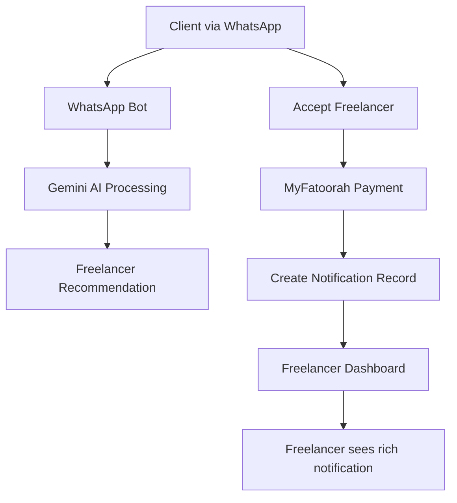

# Client-to-Freelancer Notification System Roadmap

## 🎯 Project Overview

### Current State Analysis
The Khadum platform currently has a sophisticated WhatsApp bot that:
- Receives client inquiries via WhatsApp
- Uses Gemini AI to understand client requirements
- Recommends suitable freelancers from the Supabase database
- Handles payment processing through MyFatoorah
- Stores conversation history and payment records

### The Gap
**Missing Link**: When a client chooses a freelancer through the WhatsApp bot, the selected freelancer has no immediate visibility into:
- Who chose them
- Why they were selected
- Client contact information
- Project requirements from the conversation
- Timeline expectations

### The Vision
Create a seamless notification system where freelancers receive rich, contextual notifications in their dashboard when clients select them, complete with all relevant project and client information extracted from the WhatsApp conversation.

---

## 🏗️ System Architecture Overview



---

## 📋 Implementation Roadmap

### Phase 1: Database Foundation
**Objective**: Create the data structure to store client selection notifications

#### 1.1 Design Notification Table Schema
```sql
CREATE TABLE client_freelancer_notifications (
  id UUID PRIMARY KEY DEFAULT gen_random_uuid(),
  freelancer_id UUID REFERENCES freelancers(id),
  client_whatsapp_phone VARCHAR(20),
  client_name VARCHAR(255),
  client_email VARCHAR(255),
  
  -- Project Information
  project_description TEXT,
  project_requirements TEXT,
  estimated_budget DECIMAL(10,2),
  timeline_expectation VARCHAR(255),
  
  -- Selection Context
  why_chosen TEXT,
  conversation_summary TEXT,
  ai_recommendation_reason TEXT,
  
  -- Metadata
  selection_date TIMESTAMP DEFAULT NOW(),
  payment_amount DECIMAL(10,2),
  payment_status VARCHAR(50),
  myfatoorah_invoice_id VARCHAR(255),
  
  -- Notification State
  is_read BOOLEAN DEFAULT FALSE,
  is_archived BOOLEAN DEFAULT FALSE,
  freelancer_response TEXT,
  response_date TIMESTAMP,
  
  created_at TIMESTAMP DEFAULT NOW(),
  updated_at TIMESTAMP DEFAULT NOW()
);
```

#### 1.2 Key Design Decisions
- **Rich Context Storage**: Store not just basic info but project requirements, timeline, budget
- **Conversation Summary**: AI-generated summary of the entire client conversation
- **Selection Reasoning**: Why this freelancer was chosen (from AI recommendation)
- **Response Tracking**: Allow freelancers to respond to notifications
- **State Management**: Read/unread, archived states for dashboard organization

---

### Phase 2: WhatsApp Bot Enhancement
**Objective**: Modify the bot to capture client selection context and create notifications

#### 2.1 Enhanced Data Capture in Message Processor
**File**: `whatsapp-bot/src/controllers/messageProcessor.js`

**Current Flow Enhancement**:
```javascript
// When client accepts freelancer recommendation
case 'accept_freelancer':
  // 1. Extract conversation context
  const conversationSummary = await this.extractProjectRequirements(from, history);
  
  // 2. Get the recommended freelancer details
  const recommendedFreelancer = await this.getLastRecommendedFreelancer(from);
  
  // 3. Generate AI analysis of why this freelancer was chosen
  const selectionReason = await this.generateSelectionReason(conversationSummary, recommendedFreelancer);
  
  // 4. Create notification record
  await this.createFreelancerNotification({
    freelancerId: recommendedFreelancer.id,
    clientPhone: from,
    clientName: name,
    conversationSummary,
    selectionReason,
    projectRequirements: conversationSummary.requirements
  });
  
  // 5. Continue with existing payment flow
  await this.handleAcceptPayment(from, name);
```

#### 2.2 New Service Methods Required

**Conversation Analysis Service**:
```javascript
// Extract structured project information from conversation
async extractProjectRequirements(clientPhone, conversationHistory) {
  const prompt = `
    Analyze this client conversation and extract:
    1. Project description (2-3 sentences)
    2. Specific requirements
    3. Timeline expectations
    4. Budget indicators
    5. Client's experience level
    6. Any special preferences
    
    Conversation: ${JSON.stringify(conversationHistory)}
  `;
  
  return await geminiService.analyzeConversation(prompt);
}

// Generate reason why freelancer was selected
async generateSelectionReason(projectInfo, freelancerProfile) {
  const prompt = `
    Based on this project: ${projectInfo}
    And this freelancer profile: ${freelancerProfile}
    
    Generate a personalized explanation of why this freelancer 
    was the best match (from the client's perspective).
  `;
  
  return await geminiService.generateSelectionReason(prompt);
}
```

#### 2.3 Integration Points
- **Payment Completion**: Link notification creation with successful payment
- **Error Handling**: Graceful fallback if notification creation fails
- **Data Validation**: Ensure all required fields are captured before notification creation

---

### Phase 3: Frontend Notification Service
**Objective**: Create the data access layer for notifications in the React frontend

#### 3.1 Notification Service API
**File**: `src/lib/notificationService.ts`

```typescript
export interface FreelancerNotification {
  id: string;
  freelancer_id: string;
  client_whatsapp_phone: string;
  client_name: string;
  client_email?: string;
  project_description: string;
  project_requirements: string;
  estimated_budget?: number;
  timeline_expectation?: string;
  why_chosen: string;
  conversation_summary: string;
  selection_date: string;
  payment_amount?: number;
  payment_status: string;
  is_read: boolean;
  is_archived: boolean;
  freelancer_response?: string;
  response_date?: string;
}

export class NotificationService {
  // Get unread notifications for freelancer
  static async getUnreadNotifications(freelancerId: string): Promise<FreelancerNotification[]>
  
  // Get all notifications with pagination
  static async getNotifications(freelancerId: string, page: number, limit: number): Promise<FreelancerNotification[]>
  
  // Mark notification as read
  static async markAsRead(notificationId: string): Promise<void>
  
  // Archive notification
  static async archiveNotification(notificationId: string): Promise<void>
  
  // Respond to notification
  static async respondToNotification(notificationId: string, response: string): Promise<void>
  
  // Get notification counts
  static async getNotificationCounts(freelancerId: string): Promise<{unread: number, total: number}>
}
```

#### 3.2 Real-time Subscription Setup
```typescript
// Real-time listener for new notifications
static subscribeToNotifications(freelancerId: string, callback: (notification: FreelancerNotification) => void) {
  return supabase
    .channel('freelancer-notifications')
    .on('postgres_changes', {
      event: 'INSERT',
      schema: 'public',
      table: 'client_freelancer_notifications',
      filter: `freelancer_id=eq.${freelancerId}`
    }, callback)
    .subscribe();
}
```

---

### Phase 4: Dashboard UI Components
**Objective**: Create beautiful, functional notification interfaces

#### 4.1 Notification Card Component
**File**: `src/components/dashboard/NotificationCard.tsx`

**Design Requirements**:
- **Rich Visual Design**: Client avatar, project preview, status indicators
- **Expandable Content**: Collapsible sections for detailed information
- **Action Buttons**: Mark as read, archive, respond, contact client
- **Responsive Layout**: Works on mobile and desktop
- **Accessibility**: Screen reader friendly, keyboard navigation

**Key Information Display**:
```
┌─────────────────────────────────────────────────────────────┐
│ 🔔 New Client Selection                                     │
│                                                             │
│ 👤 Ahmed Al-Rashid    📱 +966 50 123 4567    📧 ahmed@... │
│ 🕐 2 hours ago       💰 Budget: 1,500 SAR                  │
│                                                             │
│ 📋 Project: Logo Design for Tech Startup                   │
│ "I need a modern, minimalist logo for my tech company...   │
│                                                             │
│ ⭐ Why you were chosen:                                     │
│ "Perfect match for modern design style and tech            │
│ experience. Client appreciated your startup portfolio."    │
│                                                             │
│ [ Mark as Read ] [ Archive ] [ Contact Client ] [ Respond ]│
└─────────────────────────────────────────────────────────────┘
```

#### 4.2 Notification Center Component
**File**: `src/components/dashboard/NotificationCenter.tsx`

**Features**:
- **Filter Options**: Unread, All, Archived
- **Search Functionality**: Search by client name, project type
- **Sorting Options**: Date, priority, payment amount
- **Bulk Actions**: Mark multiple as read, archive
- **Pagination**: Handle large numbers of notifications

#### 4.3 Notification Toast System
**File**: `src/components/dashboard/NotificationToast.tsx`

**Real-time Notifications**:
- **Instant Alerts**: Toast notifications for new client selections
- **Sound Notifications**: Optional audio alerts
- **Desktop Notifications**: Browser notification API integration
- **Customizable**: User preferences for notification types

---

### Phase 5: Dashboard Integration
**Objective**: Integrate notifications seamlessly into the existing dashboard

#### 5.1 Dashboard Home Updates
**File**: `src/pages/dashboard/DashboardHome.tsx`

**New Elements**:
```typescript
// Add to stats cards
<Card className="bg-card/80 backdrop-blur-xl border-border accent-ring hover-lift">
  <CardHeader className="flex flex-row items-center justify-between space-y-0 pb-2">
    <CardTitle className="text-sm font-medium text-muted-foreground">عملاء جدد</CardTitle>
    <Bell className="h-4 w-4 text-primary" />
  </CardHeader>
  <CardContent>
    <div className="text-2xl font-bold text-foreground">{unreadNotifications}</div>
    <p className="text-xs text-muted-foreground">في انتظار ردك</p>
  </CardContent>
</Card>

// Recent Activity Section Enhancement
<div className="flex items-center space-x-4 rtl:space-x-reverse">
  <div className="w-2 h-2 bg-primary rounded-full animate-pulse"></div>
  <div className="flex-1">
    <p className="text-sm text-foreground">عميل جديد اختارك لمشروع تصميم</p>
    <p className="text-xs text-muted-foreground">أحمد الراشد - منذ دقيقتين</p>
  </div>
</div>
```

#### 5.2 Navigation Enhancement
**File**: `src/components/dashboard/ExpandableSidebar.tsx`

**Add Notifications Section**:
```typescript
<SidebarItem 
  href="/dashboard/notifications" 
  icon={Bell} 
  label="التنبيهات"
  badge={unreadCount > 0 ? unreadCount : undefined}
/>
```

#### 5.3 New Notifications Page
**File**: `src/pages/dashboard/Notifications.tsx`

**Full-Featured Notification Management**:
- **Comprehensive Listing**: All notifications with rich filtering
- **Detailed View**: Expandable notification details
- **Response Interface**: Built-in messaging system
- **Client Communication**: Direct WhatsApp/email integration
- **Analytics**: Notification response rates, client conversion metrics

---

### Phase 6: Real-time Features
**Objective**: Make the system feel alive with real-time updates

#### 6.1 WebSocket Integration
**Implementation Strategy**:
```typescript
// Custom hook for real-time notifications
export const useNotificationSubscription = (freelancerId: string) => {
  const [notifications, setNotifications] = useState<FreelancerNotification[]>([]);
  const [unreadCount, setUnreadCount] = useState(0);
  
  useEffect(() => {
    const subscription = NotificationService.subscribeToNotifications(
      freelancerId,
      (newNotification) => {
        // Add notification to state
        setNotifications(prev => [newNotification, ...prev]);
        setUnreadCount(prev => prev + 1);
        
        // Show toast notification
        toast({
          title: "عميل جديد اختارك!",
          description: `${newNotification.client_name} اختارك لمشروع ${newNotification.project_description}`,
          action: <Button>عرض التفاصيل</Button>
        });
        
        // Play notification sound
        playNotificationSound();
      }
    );
    
    return () => subscription.unsubscribe();
  }, [freelancerId]);
  
  return { notifications, unreadCount };
};
```

#### 6.2 Browser Notifications
```typescript
// Request permission and show desktop notifications
const showDesktopNotification = (notification: FreelancerNotification) => {
  if (Notification.permission === 'granted') {
    new Notification(`عميل جديد: ${notification.client_name}`, {
      body: notification.project_description,
      icon: '/favicon.ico',
      tag: notification.id
    });
  }
};
```

#### 6.3 Sound Notifications
```typescript
// Audio feedback for new notifications
const playNotificationSound = () => {
  const audio = new Audio('/notification-sound.mp3');
  audio.play().catch(console.error);
};
```

---

## 🎨 User Experience Design

### Notification Flow UX
1. **Instant Awareness**: Toast + sound when client selects freelancer
2. **Rich Context**: All project details immediately available
3. **Quick Actions**: One-click responses and client contact
4. **Follow-up Tracking**: Monitor client responses and project progress
5. **Historical Reference**: Search and review past client selections

### Mobile Responsiveness
- **Touch-Friendly**: Large tap targets for mobile interactions
- **Swipe Actions**: Swipe to mark as read, archive, or respond
- **Optimized Layout**: Condensed information display for smaller screens
- **Offline Support**: Cache notifications for offline viewing

---

## 🔧 Technical Implementation Details

### Database Optimization
```sql
-- Indexes for performance
CREATE INDEX idx_notifications_freelancer_unread ON client_freelancer_notifications(freelancer_id, is_read);
CREATE INDEX idx_notifications_date ON client_freelancer_notifications(selection_date DESC);
CREATE INDEX idx_notifications_payment_status ON client_freelancer_notifications(payment_status);
```

### Security Considerations
- **Data Privacy**: Encrypt sensitive client information
- **Access Control**: Freelancers can only see their own notifications
- **Rate Limiting**: Prevent notification spam
- **Audit Trail**: Log all notification interactions

### Performance Optimization
- **Pagination**: Load notifications in chunks
- **Caching**: Cache notification counts and recent notifications
- **Lazy Loading**: Load detailed conversation history on demand
- **Image Optimization**: Compress and resize client avatars

---

## 🧪 Testing Strategy

### Unit Testing
- **Service Layer**: Test notification CRUD operations
- **Component Testing**: Test UI component behaviors
- **Integration Testing**: Test WhatsApp bot notification creation

### End-to-End Testing
1. **Complete Flow**: Client selection → notification creation → dashboard display
2. **Real-time Testing**: Verify instant notification delivery
3. **Cross-browser Testing**: Ensure compatibility across browsers
4. **Mobile Testing**: Test responsive design and touch interactions

### Load Testing
- **High Volume**: Test with many simultaneous client selections
- **Real-time Performance**: Verify WebSocket performance under load
- **Database Performance**: Test notification queries with large datasets

---

## 📊 Success Metrics

### Key Performance Indicators (KPIs)
- **Notification Delivery Time**: < 2 seconds from client selection to freelancer notification
- **Read Rate**: % of notifications read within 1 hour
- **Response Rate**: % of notifications that receive freelancer responses
- **Client Conversion**: % of notifications that lead to actual projects

### User Experience Metrics
- **Time to First Response**: How quickly freelancers respond to notifications
- **Client Satisfaction**: Feedback on communication quality
- **Platform Engagement**: Increased dashboard usage due to notifications

---

## 🚀 Deployment Strategy

### Phase 1: Database Migration
1. Create notification table in production
2. Deploy database indexes
3. Set up monitoring for new table

### Phase 2: Backend Deployment
1. Deploy WhatsApp bot enhancements
2. Test notification creation with staging data
3. Monitor error rates and performance

### Phase 3: Frontend Deployment
1. Deploy notification service and components
2. Enable feature flag for select freelancers
3. Gradually roll out to all users

### Phase 4: Monitoring & Optimization
1. Monitor notification delivery metrics
2. Collect user feedback
3. Optimize based on usage patterns

---

## 🔮 Future Enhancements

### Advanced Features
- **AI-Powered Insights**: Analyze notification patterns to improve freelancer recommendations
- **Smart Scheduling**: Suggest optimal response times based on client timezone
- **Automated Follow-ups**: Auto-remind freelancers to respond to important notifications
- **Client Matching Score**: Show compatibility score between client and freelancer

### Integration Opportunities
- **Calendar Integration**: Add client meetings directly to freelancer calendars
- **Project Management**: Create project boards from notification details
- **Communication Hub**: Built-in chat system for client-freelancer communication
- **Invoice Generation**: Auto-generate invoices based on notification project details

---

## 📝 Implementation Checklist

### Pre-Development
- [ ] Finalize database schema design
- [ ] Create detailed UI/UX mockups
- [ ] Set up development environment
- [ ] Define API contracts

### Development Phase 1 (Database & Backend)
- [ ] Create notification table with proper indexes
- [ ] Update WhatsApp bot message processor
- [ ] Implement conversation analysis service
- [ ] Add notification creation logic
- [ ] Create database migration scripts

### Development Phase 2 (Frontend Services)
- [ ] Build notification service API
- [ ] Implement real-time subscription logic
- [ ] Create notification TypeScript interfaces
- [ ] Add error handling and loading states

### Development Phase 3 (UI Components)
- [ ] Design and build NotificationCard component
- [ ] Create NotificationCenter with filtering
- [ ] Implement toast notification system
- [ ] Build notification management page

### Development Phase 4 (Integration)
- [ ] Update dashboard home with notification stats
- [ ] Add navigation menu items
- [ ] Integrate real-time notifications
- [ ] Implement browser notifications

### Testing & Deployment
- [ ] Write comprehensive tests
- [ ] Perform end-to-end testing
- [ ] Deploy to staging environment
- [ ] Conduct user acceptance testing
- [ ] Deploy to production with monitoring

### Post-Launch
- [ ] Monitor system performance
- [ ] Collect user feedback
- [ ] Optimize based on usage patterns
- [ ] Plan future enhancement iterations

---

This roadmap provides a comprehensive guide to implementing a sophisticated client-to-freelancer notification system that will significantly enhance the user experience on the Khadum platform. The system will create a seamless connection between client selections and freelancer awareness, ultimately leading to faster response times and better client-freelancer relationships.